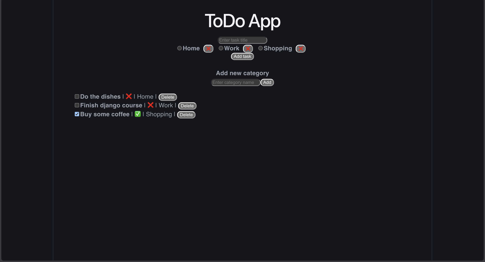

# ToDo App

A sleek and functional ToDo application featuring a dynamic category system and robust multi-level data validation.

### 🚀 Tech Stack

* **Frontend:** React.js, CSS3
* **Backend:** Django, Django REST Framework
* **Database:** PostgreSQL
* **Tools:** Git, Postman

### 🌟 Key Features

* **Task Management:** Easily add and remove tasks.
* **Dynamic Categories:** Create and manage custom categories for better organization.
* **Smart Sorting:** Tasks are automatically sorted (Pending tasks first, Completed at the bottom).
* **Real-time Validation:** Instant feedback on duplicate categories or empty fields.

### ⚙️ Installation & Setup

#### Requirements
* Python 3.x
* Node.js & npm
* PostgreSQL installed and running on your machine

#### Backend (Django)
1.  Navigate to the backend folder: `cd backend_folder_name`
2.  Create a virtual environment: `python -m venv venv`
3.  Activate it: 
    * Windows: `venv\Scripts\activate`
    * macOS/Linux: `source venv/bin/activate`
4.  Install dependencies: `pip install -r requirements.txt`
5.  Apply migrations: `python manage.py migrate`
6.  Start the server: `python manage.py runserver`

#### Database (PostgresSQL)
1.  Create Database: Create a new database named todo_db in your PostgreSQL instance.
2.  Configure Credentials: Update your settings.py (or .env file) with your database details
3.  Apply Migrations: `python manage.py migrate`
#### Frontend (React)
1.  Navigate to the frontend folder: `cd frontend_folder_name`
2.  Install packages: `npm install`
3.  Launch the app: `npm start`

---

### 💡 What I have learned?

* **Fullstack Integration:** I gained hands-on experience connecting a React frontend with a Django REST API. I understood the concept of the "Source of Truth" residing in the database while the frontend acts as a reactive state representation.
* **Asynchronous Programming:** I mastered `fetch` and `Promises`. I learned how to handle the asynchronous nature of network requests.
* **Multi-level Validation:** I implemented a 2-layer validation strategy:
    * **Frontend:** Focused on User Experience (UX) by providing instant feedback and preventing unnecessary API calls (e.g., duplicate checking "on the fly").
    * **Backend:** Focused on data integrity and security (e.g., using `unique=True` in Django models) to protect the database from invalid entries via external tools like Postman.